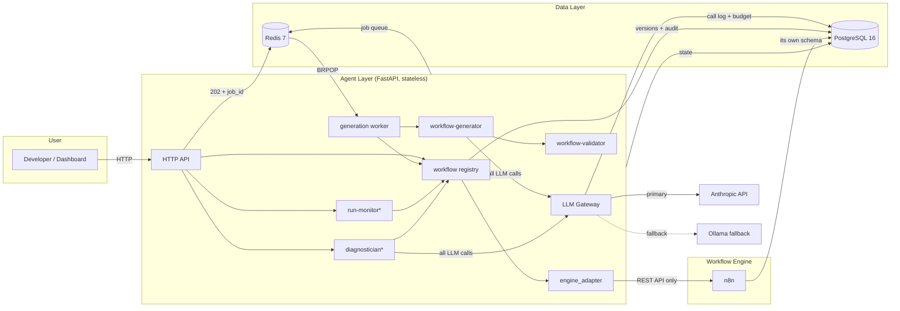
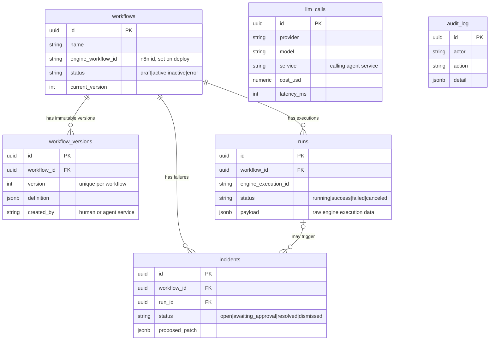

# Forge Architecture

> Phase 3 (Workflow generator agent). Update this document whenever a component changes.

## System diagram

\* Components marked with an asterisk arrive in Phase 4; the boxes exist now so the boundaries are designed in from day one.

## Component responsibilities

| Component | Phase | Responsibility |
|---|---|---|
| **n8n** | 1 | Executes workflows. Managed exclusively through its public REST API — never hand-edited in the UI. Swappable: nothing outside `engine_adapter` may know it's n8n. |
| **Agent layer (FastAPI)** | 1 | Stateless brain. All state lives in Postgres/Redis so instances can scale horizontally. Exposes `/health` and the `/workflows` registry API. |
| **LLM Gateway** | 1 | The single choke point for every LLM call. Logs model, tokens, cost, purpose, and latency to `llm_calls`; enforces the daily budget as a hard stop; retries transient Anthropic errors with exponential backoff; falls back to Ollama when enabled. |
| **PostgreSQL** | 1 | Workflow registry (versioned), runs, incidents, LLM call log, audit trail. n8n also stores its own state here, in a separate `n8n` schema. |
| **Redis** | 1 | Job queue (from Phase 3) and caching. AOF persistence on so queued jobs survive restarts. |
| **engine_adapter** | 2 | The only module allowed to know the engine is n8n. Abstract `EngineAdapter` interface + `N8nAdapter` over `/api/v1`: create/update/get/delete/activate/deactivate workflows, fetch executions (statuses normalized to Forge's `RunStatus`). |
| **workflow registry** | 2 | Versioned deploys: every deploy writes an immutable `workflow_versions` row in the same transaction as the engine call; one-call roll-forward rollback; deletes snapshot the live engine definition first; every action audited (ADR-002). |
| **workflow-generator** | 3 | NL instruction → n8n workflow JSON via the LLM Gateway. Prompt is rendered from the node catalog (`forge/nodes.py`) with few-shot examples; one repair round feeds validator errors back to the model (ADR-003). |
| **workflow-validator** | 3 | Static checks before anything touches the engine: schema, node whitelist, connection integrity, credential hygiene (no inline secrets), destructive-action detection. |
| **generation worker** | 3 | Separate process (`generation-worker` compose service) consuming the Redis queue via BRPOP, so LLM latency never blocks the API. Destructive workflows park at `requires_approval` unless the request set `allow_destructive`. |
| **run-monitor / diagnostician** | 4 | Ingest executions, compute health, root-cause failures, propose patches (risky ones need human approval). |
| **Dashboard (Next.js)** | 5 | Workflow list, run timeline, incident feed, LLM cost breakdown, chat box. |

## Data flow (Phase 1)

1. A caller (later: generator/diagnostician services) invokes `LLMGateway.complete(prompt, service, purpose, ...)`.
2. The gateway sums today's `llm_calls.cost_usd` (UTC day). If the sum has reached `LLM_DAILY_BUDGET_USD`, the call is refused with `BudgetExceededError` and the refusal itself is logged.
3. Otherwise it calls Anthropic, retrying 429/5xx/connection errors with exponential backoff (base delay doubles per attempt).
4. If Anthropic is still down and `OLLAMA_ENABLED=true`, it calls the local Ollama instance (cost $0).
5. The call — success or failure — is written to `llm_calls` with provider, model, tokens, cost, latency.

The budget is derived from the log table itself rather than a separate counter, so any number of gateway instances enforce the same limit without coordination.

## Data model

`llm_calls` and `audit_log` are standalone append-only tables (no FKs) so they can never block a workflow delete and are cheap to partition later.

## Scalability posture

- **Stateless services** — the agent layer holds no in-process state; kill/scale at will.
- **Budget without coordination** — enforced from the shared `llm_calls` table, not per-instance counters.
- **Engine swappability** — `engine_workflow_id` / `engine_execution_id` are generic strings; only `engine_adapter` (Phase 2) will speak n8n.
- **Migrations on boot** — the agent-layer container runs `alembic upgrade head` before starting, so `docker compose up` is always schema-correct.
