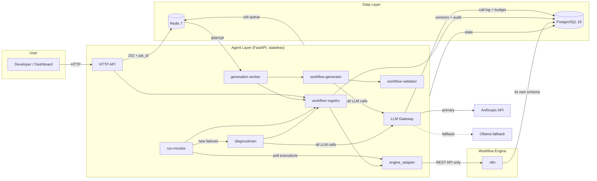
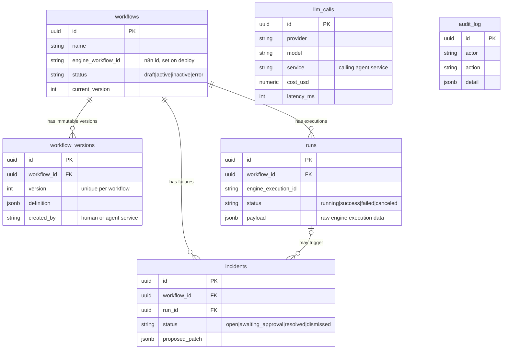

# Forge Architecture

> Phase 6 (Hardening & scale). Update this document whenever a component changes.

## System diagram




## Component responsibilities

| Component | Phase | Responsibility |
|---|---|---|
| **n8n** | 1 | Executes workflows. Managed exclusively through its public REST API — never hand-edited in the UI. Swappable: nothing outside `engine_adapter` may know it's n8n. |
| **Agent layer (FastAPI)** | 1 | Stateless brain. All state lives in Postgres/Redis so instances can scale horizontally. Exposes `/health` and the `/workflows` registry API. |
| **LLM Gateway** | 1 | The single choke point for every LLM call. Logs model, tokens, cost, purpose, and latency to `llm_calls`; enforces the daily budget as a hard stop; retries transient Anthropic errors with exponential backoff; falls back to Ollama when enabled. |
| **PostgreSQL** | 1 | Workflow registry (versioned), runs, incidents, LLM call log, audit trail. n8n also stores its own state here, in a separate `n8n` schema. |
| **Redis** | 1 | Job queue (from Phase 3) and caching. AOF persistence on so queued jobs survive restarts. |
| **engine_adapter** | 2 | The only module allowed to know the engine is n8n. Abstract `EngineAdapter` interface + `N8nAdapter` over `/api/v1`: create/update/get/delete/activate/deactivate workflows, fetch executions (statuses normalized to Forge's `RunStatus`). |
| **workflow registry** | 2 | Versioned deploys: every deploy writes an immutable `workflow_versions` row in the same transaction as the engine call; one-call roll-forward rollback; deletes snapshot the live engine definition first; every action audited (ADR-002). |
| **workflow-generator** | 3 | NL instruction → n8n workflow JSON via the LLM Gateway. Prompt is rendered from the node catalog (`forge/nodes.py`) with few-shot examples; one repair round feeds validator errors back to the model (ADR-003). |
| **workflow-validator** | 3 | Static checks before anything touches the engine: schema, node whitelist, connection integrity, credential hygiene (no inline secrets), destructive-action detection. |
| **generation worker** | 3 | Separate process (`generation-worker` compose service) consuming the Redis queue via BRPOP, so LLM latency never blocks the API. Destructive workflows park at `requires_approval` unless the request set `allow_destructive`. |
| **run-monitor** | 4 | Separate process (`run-monitor` compose service) polling the engine every `MONITOR_POLL_SECONDS`; mirrors executions into `runs` (idempotent upsert by engine execution id) and computes per-workflow health (healthy / degraded / failing / unknown over the last 20 runs). |
| **diagnostician** | 4 | On each newly failed run: root-cause analysis via the LLM Gateway → optional patch → static validation → risk rubric (ADR-004). LOW-risk patches auto-deploy through the registry (versioned backup + audit for free); HIGH-risk ones become `awaiting_approval` incidents with one-call approve/dismiss. Idempotent per run. |
| **Dashboard (Next.js 14)** | 5 | Server components read the agent-layer API directly (`FORGE_API_URL`); browser interactions (chat, approve/dismiss) go through a `/api/forge/[...path]` proxy route, so there's no CORS config and no build-time API URLs. Pages: overview (workflow list + health badges + chat panel), workflow detail (run timeline + version log), incidents (approve/dismiss patches), costs (budget bar + pure-Tailwind daily chart + per-service table). |

## Data flow (Phase 1)

1. A caller (later: generator/diagnostician services) invokes `LLMGateway.complete(prompt, service, purpose, ...)`.
2. The gateway sums today's `llm_calls.cost_usd` (UTC day). If the sum has reached `LLM_DAILY_BUDGET_USD`, the call is refused with `BudgetExceededError` and the refusal itself is logged.
3. Otherwise it calls Anthropic, retrying 429/5xx/connection errors with exponential backoff (base delay doubles per attempt).
4. If Anthropic is still down and `OLLAMA_ENABLED=true`, it calls the local Ollama instance (cost $0).
5. The call — success or failure — is written to `llm_calls` with provider, model, tokens, cost, latency.

The budget is derived from the log table itself rather than a separate counter, so any number of gateway instances enforce the same limit without coordination.

## Data model



`llm_calls` and `audit_log` are standalone append-only tables (no FKs) so they can never block a workflow delete and are cheap to partition later.

## Scalability posture & horizontal scaling

- **Stateless services** — the API, generation worker, and run monitor hold no in-process state. Scale with plain compose:
  ```bash
  docker compose up -d --scale agent-layer=3 --scale generation-worker=4
  ```
  BRPOP delivers each queued job to exactly one worker; run ingest and diagnosis are idempotent (upsert by engine execution id, one unresolved incident per run), so overlapping monitor instances converge instead of duplicating work.
- **Budget & rate limits without coordination** — both are computed from the shared `llm_calls` table (`budget.py`, `ratelimit.py`), so N gateway instances enforce one daily budget and one per-service calls/minute ceiling. Gateway refusals are logged with a `refused:` error prefix and excluded from the rate window.
- **Engine swappability** — `engine_workflow_id` / `engine_execution_id` are generic strings; only `engine_adapter` speaks n8n. n8n's own queue mode is a compose-only change when engine throughput matters.
- **Migrations on boot** — the agent-layer container runs `alembic upgrade head` before starting, so `docker compose up` is always schema-correct.
- **Structured logs** — every Python process emits one JSON object per line on stdout (`forge/logsetup.py`, `LOG_FORMAT=json|text`), ready for any container log pipeline.
- **Measured, not guessed** — `loadtest/locustfile.py` (locust) replays dashboard-shaped read traffic and opt-in generation submissions; run it before and after scaling changes. The ordered growth path (more workers → PgBouncer → counters to Redis → table partitioning → n8n queue mode) is ADR-005.
